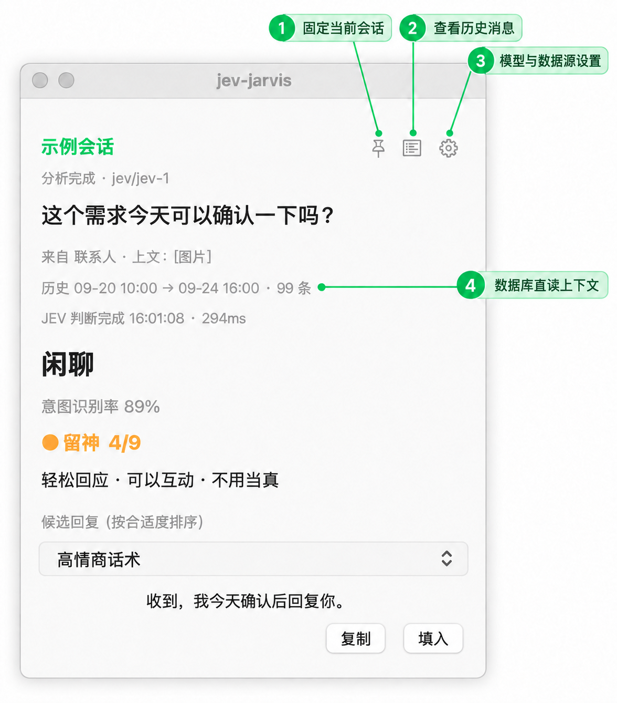

# jev-chat-jarvis（macOS）

贴在微信旁边的对话副驾：读取新消息，判断真实意图与风险，生成可选回复；只有你点击后才会把文字填入输入框，**不会自动发送**。

主运行链路不注入、不 hook、不写微信数据库。默认优先使用数据库直读，缺少密钥或 `sqlcipher` 时会明确退回 OCR 读屏。



> 截图来自真实 macOS 面板；会话名、联系人、消息、时间与候选回复均已替换为示例内容。

## 最新特性

| 能力 | 现在支持什么 |
|---|---|
| **数据库直读（默认）** | 用 `sqlcipher -readonly` 打开微信 4.x 加密库；不用周期性截屏，屏外历史也能读取 |
| **真实上下文** | 默认把当前会话最近 100 条真实消息交给判断与生成；面板同时显示时间范围、条数和 JEV 耗时 |
| **会话控制** | 图钉手动固定会话；菜单栏也能切换“自动 / 最近活跃会话”，避免无未读会话无法自动跟随 |
| **历史消息查看** | 列表按钮打开这一跳实际读取的消息，默认滚到最新一条；可核对模型究竟看到了什么 |
| **历史会话分析** | 独立窗口和 CLI 支持会话列表、总结、意图分布、未回复消息候选 |
| **本地或局域网 Jev** | 判断层可使用本地 `decider-2b`、TypeSafe/Jev API，或可信局域网部署的 Jev 服务 |
| **候选回复** | 10 种内置话术，可同时选择多种；每种生成 2 条候选，先展示再排序 |
| **原生模型设置** | 图形界面配置 Jev、OpenAI、Anthropic、数据源和密钥文件；支持拉取模型列表和真实连接测试 |
| **安全填入** | 优先通过 macOS 辅助功能写入并回读确认；不覆盖剪贴板、不模拟 `Cmd+V`、不按发送键 |

## 运行链路

```text
数据库直读（默认） ─┐
                    ├─> 消息停稳 ─> 意图/风险判断 ─> 候选生成 ─> 排序 ─> 悬浮窗
OCR 读屏（回退） ───┘                                               │
                                                                  └─ 用户点击“填入”
```

- 消息一出现，判断与候选生成并行启动；停稳窗口只负责防止连续消息刷屏。
- 判断层和生成层彼此独立：没有生成层 Key 仍能看意图和风险；没有 Jev Key 时判断走本地模型。
- 数据库模式不会为消息识别截屏；OCR 模式才需要“屏幕录制”权限。

## 快速开始

### 方式一：下载 `.app`

从 [Releases](https://github.com/jev-chat/jev-chat-jarvis-mac/releases) 下载，解压后拖入“应用程序”。当前版本未做 Apple 公证，首次需要**右键 → 打开**。

首次启动会检查运行环境。缺少固定版本 `uv 0.12.18` 时，启动器会下载 Astral 官方安装脚本，校验内置 SHA256 后再执行；随后按随包 `uv.lock` 创建 Python 3.12 环境。

### 方式二：从源码运行

```bash
./start.command
```

想临时强制使用 OCR：

```bash
./start.command --source ocr
```

### 第一次先选数据源

不提取数据库密钥也能运行：默认的 `db` 请求会自动退回 OCR，并在日志和界面说明原因。

| | 数据库直读（推荐） | OCR 读屏（零准备回退） |
|---|---|---|
| 消息来源 | 微信本地加密库 | 微信窗口画面 + Vision |
| 上下文 | 默认最近 100 条真实历史 | 屏幕上可见的最近消息 |
| 屏幕录制 | 不需要 | 需要 |
| 屏外消息 | 支持 | 不支持 |
| 前置条件 | 微信 4.x、密钥、`sqlcipher` | 无 |
| 主要取舍 | 首次提取需要管理员权限并重签微信 | 微信改版、遮挡或复杂卡片可能影响 OCR |

启用数据库直读：

```bash
brew install sqlcipher
./tools/extract_wechat_keys.command
```

提取脚本会在执行前逐项说明并要求确认。它会对 `/Applications/WeChat.app` 做一次 ad-hoc 重签名，并可能要求微信退出后重新登录；微信升级后可能需要重新提取。默认只生成仓库外的密钥文件，不生成明文数据库快照。

## 面板操作

| 入口 | 作用 |
|---|---|
| 图钉 | 手动固定当前关注的会话；选择“自动”恢复跟随 |
| 列表 | 查看这一跳实际读到的消息、方向和时间，窗口自动滚到最新消息 |
| 齿轮 | 配置判断模型、生成模型、数据源和数据库密钥路径 |
| 话术下拉框 | 最多同时选择多种回复风格；切换后立即针对当前消息重新生成 |
| 复制 | 复制候选文本，不修改微信 |
| 填入 | 把候选写入当前微信输入框并回读确认，仍需用户自己发送 |

数据库模式下，面板两行元信息是核对依据：

```text
历史 09-20 10:00 → 09-24 16:00 · 99 条
JEV 判断完成 16:01:08 · 294ms
```

## 模型与配置

配置文件只有一种格式：`${XDG_CONFIG_HOME:-$HOME/.config}/jev-jarvis/env`。设置窗口和手工编辑使用同一文件，保存后需要重启应用。

| 层 | 未配置时 | 配置后发送什么 |
|---|---|---|
| 判断层（TypeSafe/Jev） | 本地 `decider-2b` | 当前消息、判断问题和选定上下文 |
| 生成层（OpenAI/Anthropic 兼容） | 不生成候选 | 当前消息、上下文、意图和话术要求 |

### 图形界面

点击齿轮或菜单栏 **J → 模型设置…**：

- Jev、OpenAI、Anthropic 各自配置 Key、Base URL、Model。
- 可以从服务的 `/models` 获取模型列表，也可以手填模型名。
- “测试连接”只发送固定测试语句，不读取微信内容。
- Key 以掩码显示；配置文件权限保持为 `600`。
- 环境变量优先于用户 env，用户 env 优先于项目 `.env`；提供 Key 的来源同时决定对应的 URL 和模型。

### 手工配置示例

```bash
mkdir -p ~/.config/jev-jarvis
cat > ~/.config/jev-jarvis/env <<'ENV'
# 判断层：不填则使用本地 decider-2b
export TYPESAFE_API_KEY=""
export TYPESAFE_BASE_URL="https://api.typesafe.ai"
export TYPESAFE_MODEL="jev-latest"

# 生成层：任意 OpenAI 兼容端点
export OPENAI_API_KEY=""
export OPENAI_BASE_URL="https://api.deepseek.com/v1"
export OPENAI_MODEL="deepseek-chat"
ENV
chmod 600 ~/.config/jev-jarvis/env
```

### 可信局域网 Jev

远程服务默认必须使用 HTTPS；HTTP 默认只允许本机 loopback。若 Jev 部署在你信任的 RFC1918 局域网，可显式开启：

```bash
export TYPESAFE_API_KEY="替换为新密钥"
export TYPESAFE_BASE_URL="http://192.168.1.20:8000"
export TYPESAFE_MODEL="jev-1"
export JEV_ALLOW_INSECURE_HTTP=1
```

该开关只对 Jev 生效，只放行 `10.0.0.0/8`、`172.16.0.0/12`、`192.168.0.0/16` 的 IP 地址，不会放开公网 HTTP，也不会影响生成层。HTTP 会明文传输 Key 和聊天文字，只应在可信网络中使用。

### 常用高级配置

| 配置 | 说明 |
|---|---|
| `JEV_SOURCE=db\|ocr` | 选择数据库直读或 OCR；命令行 `--source` 优先级更高 |
| `JEV_DB_WATCH=follow\|all` | 只跟随当前会话，或监听所有会话的新消息 |
| `JEV_CONTEXT_MESSAGES=N` | 从本次读到的消息中取 N 条；代码上限 400，当前数据库读取窗口默认为 100 条 |
| `JEV_TONES="名称=说明\|名称=说明"` | 新增或覆盖回复话术 |
| `JEV_BOXES=1` | OCR 模式显示消息检测框；两种模式都可显示输入目标 |
| `OPENAI_EXTRA_BODY='{"enable_thinking":false}'` | 给 OpenAI 兼容请求附加字段；thinking 模型容易把候选预算耗在思考中 |

## 隐私与安全边界

| 行为 | 是否发生 | 边界 |
|---|---|---|
| 注入、hook、自动发送 | 否 | 主应用不具备自动发送能力 |
| 写微信数据库 | 否 | 数据库始终用 `sqlcipher -readonly` 打开 |
| 上传截图像素 | 否 | OCR 使用 macOS Vision 在本机识别 |
| 发送聊天文字到模型服务 | 条件性 | 只在配置 Jev 或生成层 Key 后，发送到用户指定端点 |
| 修改微信安装 | 条件性 | 只有用户显式运行密钥提取脚本时，会用 `sudo` 做 ad-hoc 重签名 |
| 修改剪贴板 | “复制”按钮会；“填入”不会 | 填入通过辅助功能接口，不使用 `Cmd+V` |

请只读取你自己账号、自己设备上的聊天数据，并遵守微信软件许可协议。项目无法承诺“零封号风险”；数据库方案涉及重签名，使用前应理解其影响。

## 数据库直读细节

<details>
<summary>依赖、密钥位置与读取规则</summary>

前置条件：

- macOS 微信 4.x，安装在 `/Applications/WeChat.app`。
- `brew install sqlcipher`。
- 首次抓取 passphrase 时可能需要 Xcode Command Line Tools：`xcode-select --install`。
- macOS 15+ 可能需要给执行命令的终端开启“系统设置 → 隐私与安全性 → 应用管理”。

默认文件：

- 密钥：`~/Library/Application Support/jev-jarvis/wechat_keys.json`（0600）。
- passphrase 缓存：`~/.wcdb-key-tool/wechat-passphrase.json`（0600）。
- 微信库：`~/Library/Containers/com.tencent.xinWeChat/Data/Documents/xwechat_files/<账号目录>/db_storage/`。

读取实现：

- 消息分布在 `message_0/1/2.db`、`biz_message_0/1/2.db`，代码跨分片合并、排序、去重。
- 每个库使用独立 raw key；发送者 `Name2Id` 映射也按库解析。
- `WCDB_CT_message_content = 4` 的正文由 Python 侧解压 zstd。
- `.material` 增量合并期间可能短暂出现 `file is not a database`，读取层会重试。
- 图片只在当前会话的 `msg/attach/<md5(username)>/...` 子树按时间匹配，避免跨会话误配。
- 微信没有可靠记录“打开了哪个无未读会话”，因此这类会话必须用图钉手动固定。

第三方密钥工具位于 `tools/wcdb_key_tool/`，按 MIT 原样引入，来源和 SHA256 见 [NOTICE](tools/wcdb_key_tool/NOTICE.md)。

</details>

## 历史会话工具

悬浮窗列表按钮用于查看当前上下文；独立历史工具用于跨会话分析：

```bash
uv run python src/history_analyze.py --live list --top 15
uv run python src/history_analyze.py --live summary "会话名"
uv run python src/history_analyze.py --live intent  "会话名"
uv run python src/history_analyze.py --live reply   "会话名"
JEV_LIVE_DB=1 uv run python src/history_ui.py
```

- `summary` / `reply` 会把所选对话文字发送给生成层配置的模型服务。
- `intent` 使用与悬浮窗相同的判断后端：未配置 Jev 时本地运行，配置后会发送到 Jev 服务。
- 历史消息按时间正序显示，窗口打开时自动滚到最新一条。

## 日志、验证与排障

日志位于 `~/Library/Logs/jev-jarvis.log`，包含数据源、后端、消息条数、上下文条数和分阶段耗时。日志设计上不主动记录消息正文或候选正文；分享 issue 前仍建议人工检查并脱敏。

常用检查：

```bash
uv run python src/wechat_keys.py                 # 密钥、sqlcipher 与下一步
uv run python src/judge.py "这个需求你今天跟一下"  # 判断层
uv run python src/generate.py --check            # 生成层配置解析
uv run python src/judge_zh_test.py               # 22 条中文意图回归
uv run python -B -m unittest discover -s tests   # 离线回归
uv run python -B probe/live_db_smoke.py          # 真实 live DB 冒烟
uv run python -B probe/history_ui_smoke.py        # 历史窗口冒烟
uv run python probe/bootstrap_regression.py      # 两种启动入口回归
```

Jev 调用失败时，日志会立即记录脱敏后的异常类型并标明是否切换到本地模型；启动日志也会显示实际模型和“私网 HTTP 已允许”状态。

## 已知限制

- 数据库冷启动需要扫描多个分片；公众号大库或几百 MB WAL 可能让单次读取达到数秒。
- 微信窗口不在屏幕上时，数据库分析仍可运行，但没有窗口几何，无法“填入”。
- OCR 依赖当前微信布局；深色主题、全屏、多显示器、引用消息和复杂卡片仍可能误判。
- 本地判断模型首次使用需要下载并预热，第一条消息明显更慢。
- 新版图片附件可能使用 V2 加密格式，只能显示 `[图片]` 占位。
- `.app` 当前没有 Apple 公证，首次启动需要右键打开。

## 磁盘占用与清理

| 内容 | 默认位置 | 说明 |
|---|---|---|
| 本地判断模型 | `~/.cache/huggingface/hub/models--Mapika--decider-2b` | 删除后下次本地判断会重新下载 |
| Python 环境 | `~/Library/Application Support/jev-jarvis/venv` | 删除 `.app` 不会自动清理 |
| 数据库密钥 | `~/Library/Application Support/jev-jarvis/wechat_keys.json` | 删除后数据库模式会退回 OCR |
| 可选解密快照 | `JEV_DB_DIR` 指定目录 | 默认提取流程不会创建 |

## 开发与发布

- 贡献前先读 [CONTRIBUTING.md](CONTRIBUTING.md) 和 [AGENTS.md](AGENTS.md)，按 issue 认领协议协作。
- 完整测试：`uv run python -B -m unittest discover -s tests`。
- 构建应用：`./packaging/build_app.sh`。
- 发布：`./packaging/release.sh --publish`；脚本检查干净工作树、解压回验并生成 SHA256。
- 版本号只有 `pyproject.toml` 一处。
- `tools/wcdb_key_tool/` 是第三方原样快照；更新时需重新复制并同步 NOTICE，项目逻辑不要写进该文件。

## 交流反馈

Issue、功能建议和贡献可以直接走 GitHub。也可以扫码加入交流群；二维码可能过期，失效时请提 issue：


## 许可与免责

MIT，见 [LICENSE](LICENSE)。本项目只面向用户本人设备和本人账号的数据；请勿用于读取未经授权的聊天记录。模型判断和候选回复可能出错，发送前必须由用户自行确认。
